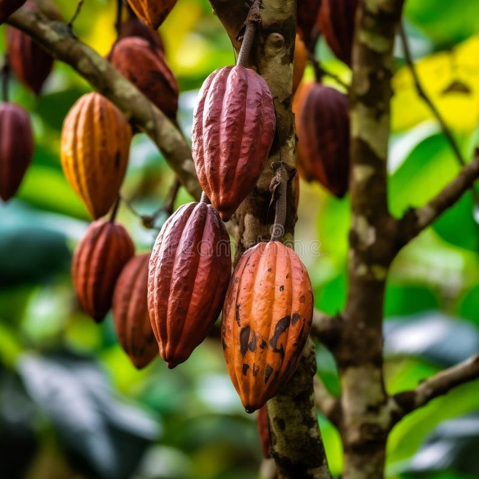
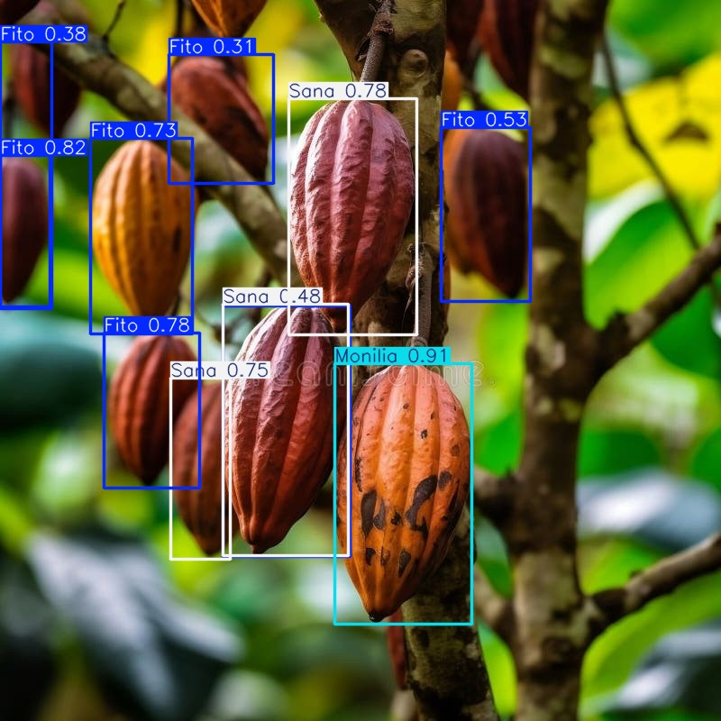
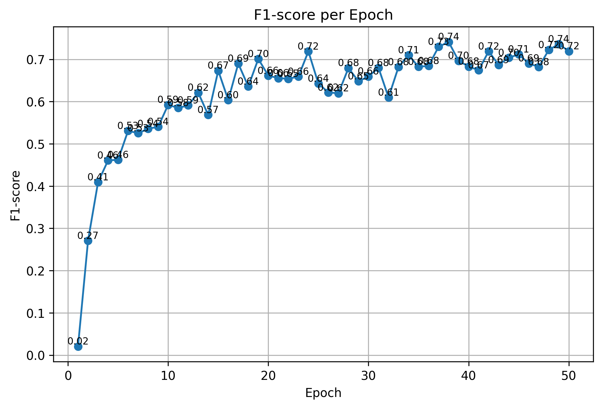
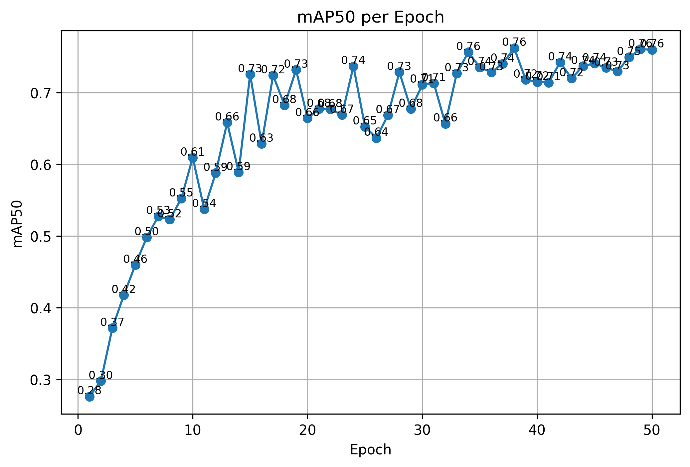

<h1 align="center">🌿 YOLO Cocoa Disease Detection</h1>

  
  
  

<h2>🖼️ Model Inference Preview</h2>

Below is a comparison between a sample raw test image and the model's prediction identifying the cocoa pod status.

  <table width="100%">
    <tr>
      <td align="center" width="50%"><b>Original Test Image</b></td>
      <td align="center" width="50%"><b>YOLO Detection Result</b></td>
    </tr>
    <tr>
      <td></td>
      <td></td>
    </tr>
  </table>

<h2>📈 Performance Metrics</h2>

The model evaluation is based on standard object detection metrics, focusing on the balance between precision and recall.

  <table width="100%">
    <tr>
      <td align="center" width="50%"><b>F1-Score Curve</b></td>
      <td align="center" width="50%"><b>mAP@50</b></td>
    </tr>
    <tr>
      <td></td>
      <td></td>
    </tr>
  </table>

<h2>📂 Detailed Directory Descriptions</h2>

<table width="100%">
  <thead>
    <tr>
      <th align="left" width="20%">Directory</th>
      <th align="left">Description & Purpose</th>
    </tr>
  </thead>
  <tbody>
    <tr>
      <td><b>📁 Data</b></td>
      <td><b>Raw Data Source:</b> Contains the original dataset categorized into <code>fito</code> (Phytophthora), <code>monilia</code> (Moniliophthora roreri), and <code>sana</code> (healthy). This is the baseline data before any split or augmentation.</td>
    </tr>
    <tr>
      <td><b>📁 Images</b></td>
      <td><b>Neural Network Inputs:</b> Features the processed image set split into <code>train</code> and <code>val</code> (validation) subfolders. These images are scaled and prepared for the YOLO training pipeline.</td>
    </tr>
    <tr>
      <td><b>📁 Labels</b></td>
      <td><b>Ground Truth Annotations:</b> Contains <code>.txt</code> files for every image in the dataset. Each file uses the YOLO format specifying the class index and normalized bounding box coordinates.</td>
    </tr>
    <tr>
      <td><b>📁 metric_charts</b></td>
      <td><b>Performance Analytics:</b> A repository of visual assessments including <i>F1-Score</i>, <i>mAP50</i>, and loss curves used to diagnose model convergence and accuracy.</td>
    </tr>
    <tr>
      <td><b>📁 Models</b></td>
      <td><b>Saved Weights:</b>
        <ul>
          <li><code>best.pt</code>: The model weights that yielded the highest accuracy on validation data.</li>
          <li><code>last.pt</code>: The final state of the model after the last epoch.</li>
        </ul>
      </td>
    </tr>
    <tr>
      <td><b>📁 runs</b></td>
      <td><b>Epoch Logs:</b> Detailed output from the Ultralytics training engine. It captures the technical heartbeat of each epoch, including bounding box loss and classification loss.</td>
    </tr>
    <tr>
      <td><b>📁 Test</b></td>
      <td><b>Evaluation Set:</b> A dedicated folder for images used to test the model's real-world generalization capability after training is complete.</td>
    </tr>
    <tr>
      <td><b>📁 Test_predictions</b></td>
      <td><b>Inference Results:</b> Stores the visual output of the model. These images include bounding boxes, class labels, and confidence percentages.</td>
    </tr>
  </tbody>
</table>

<h2>💻 Technical Implementation</h2>

The core logic of the project is implemented in <b><code>YOLO_Deep_Learning.ipynb</code></b>. This notebook covers:

<ul>
  <li>Configuration of the environment and YAML data pointers.</li>
  <li>Training the YOLO model on custom cocoa pod data.</li>
  <li>Executing inference on the test dataset.</li>
  <li>Exporting evaluation metrics for analysis.</li>
</ul>

  <b>Developed for Precision Cocoa Farming & Disease Prevention</b>

